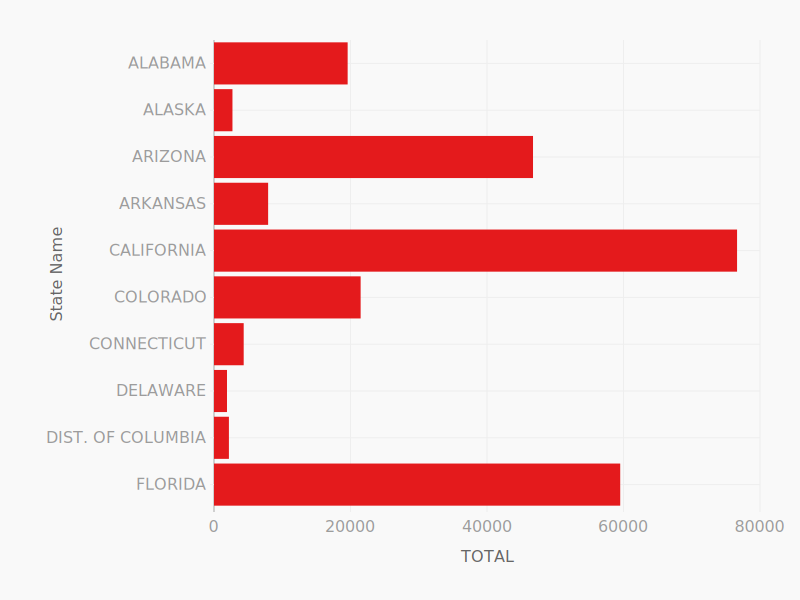
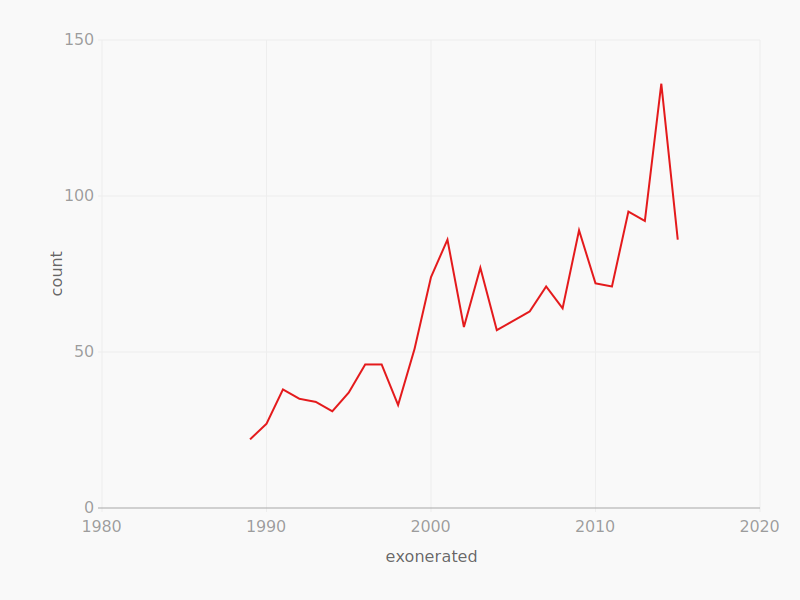
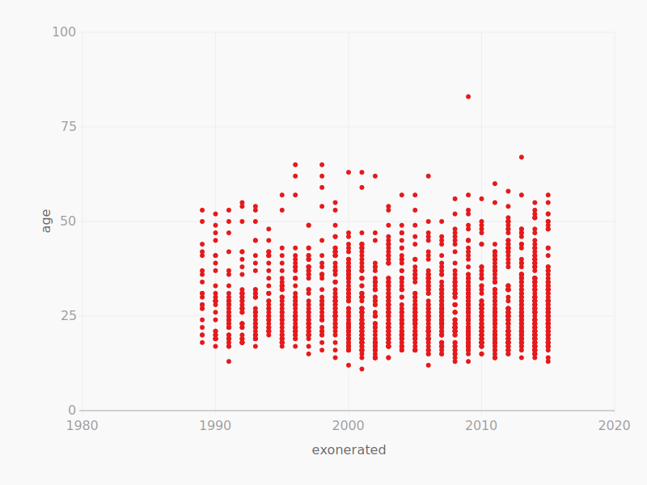
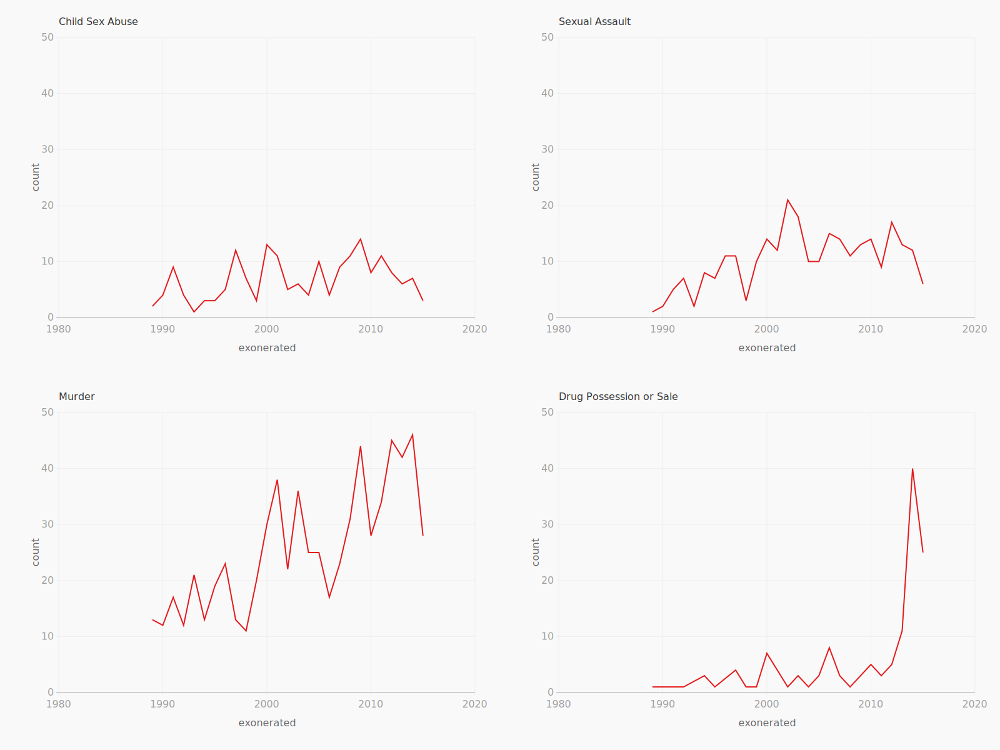

======
Charts
======

Agate offers two kinds of built in charting: very simple text bar charts and SVG charting via `leather <https://leather.rtfd.io/>`_. Both are intended for efficiently exploring data, rather than producing publication-ready charts.

Text-based bar chart
====================

agate has a builtin text-based bar-chart generator:

.. code-block:: python

    table.limit(10).print_bars('State Name', 'TOTAL', width=80)

.. code-block:: bash

    State Name         TOTAL
    ALABAMA           19,582 ▓░░░░░░░░░░░░░
    ALASKA             2,705 ▓░░
    ARIZONA           46,743 ▓░░░░░░░░░░░░░░░░░░░░░░░░░░░░░░░░
    ARKANSAS           7,932 ▓░░░░░
    CALIFORNIA        76,639 ▓░░░░░░░░░░░░░░░░░░░░░░░░░░░░░░░░░░░░░░░░░░░░░░░░░░░░
    COLORADO          21,485 ▓░░░░░░░░░░░░░░░
    CONNECTICUT        4,350 ▓░░░
    DELAWARE           1,904 ▓░
    DIST. OF COLUMBIA  2,185 ▓░
    FLORIDA           59,519 ▓░░░░░░░░░░░░░░░░░░░░░░░░░░░░░░░░░░░░░░░░
                             +-------------+------------+------------+-------------+
                             0          20,000       40,000       60,000      80,000

Text-based histogram
====================

:meth:`.Table.print_bars` can be combined with :meth:`.Table.pivot` or :meth:`.Table.bins` to produce fast histograms:

.. code-block:: Python

    table.bins('TOTAL', start=0, end=100000).print_bars('TOTAL', width=80)

.. code-block:: bash

    TOTAL              Count
    [0 - 10,000)          30 ▓░░░░░░░░░░░░░░░░░░░░░░░░░░░░░░░░░░░░░░░░░░░░░░░░░░░░░░
    [10,000 - 20,000)     12 ▓░░░░░░░░░░░░░░░░░░░░░░
    [20,000 - 30,000)      7 ▓░░░░░░░░░░░░░
    [30,000 - 40,000)      1 ▓░░
    [40,000 - 50,000)      2 ▓░░░░
    [50,000 - 60,000)      1 ▓░░
    [60,000 - 70,000)      1 ▓░░
    [70,000 - 80,000)      1 ▓░░
    [80,000 - 90,000)      0 ▓
    [90,000 - 100,000]     0 ▓
                             +-------------+------------+------------+-------------+
                             0.0          7.5         15.0         22.5         30.0

SVG bar chart
=============

.. code-block:: Python

    table.limit(10).bar_chart('State Name', 'TOTAL', 'docs/images/bar_chart.svg')

SVG column chart
================

.. code-block:: Python

    table.limit(10).column_chart('State Name', 'TOTAL', 'docs/images/column_chart.svg')

.. figure:: ../images/column_chart.svg

SVG line chart
==============

.. code-block:: Python

    by_year_exonerated = table.group_by('exonerated')
    counts = by_year_exonerated.aggregate([
        ('count', agate.Count())
    ])

    counts.order_by('exonerated').line_chart('exonerated', 'count', 'docs/images/line_chart.svg')

SVG dots chart
==============

.. code-block:: Python

    table.scatterplot('exonerated', 'age', 'docs/images/dots_chart.svg')

SVG lattice chart
==================

.. code-block:: Python

    top_crimes = table.group_by('crime').having([
        ('count', agate.Count())
    ], lambda t: t['count'] > 100)

    by_year = top_crimes.group_by('exonerated')
    
    counts = by_year.aggregate([
        ('count', agate.Count())
    ])

    by_crime = counts.group_by('crime')

    by_crime.order_by('exonerated').line_chart('exonerated', 'count', 'docs/images/lattice.svg')

Using matplotlib
================

If you need to make more complex charts, you can always use agate with `matplotlib <https://matplotlib.org/>`_.

Here is an example of how you might generate a line chart:

.. code-block:: python

    import pylab

    pylab.plot(table.columns['homeruns'], table.columns['wins'])
    pylab.xlabel('Homeruns')
    pylab.ylabel('Wins')
    pylab.title('How homeruns correlate to wins')

    pylab.show()
